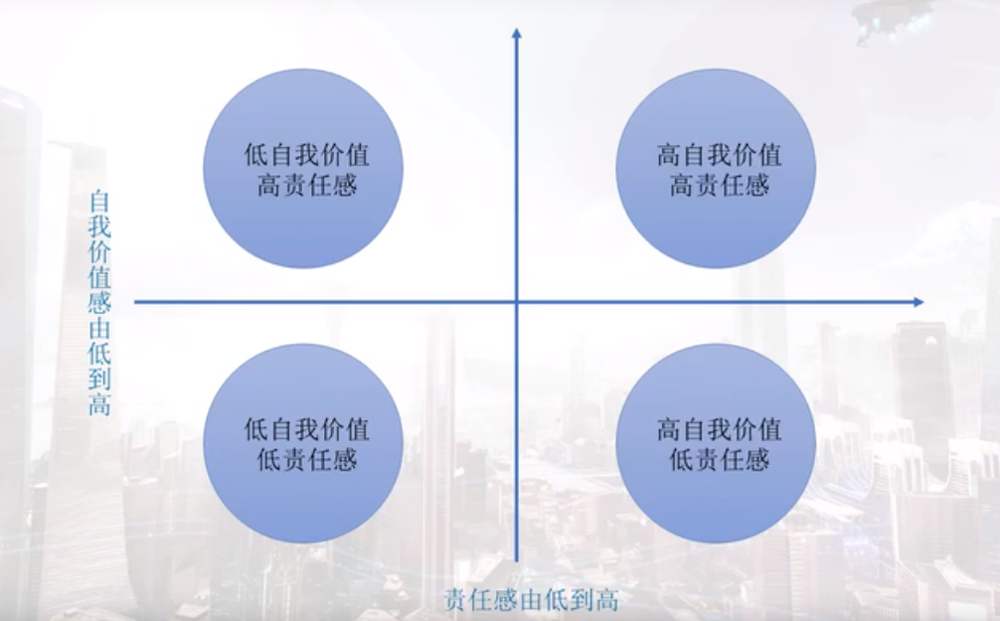

> 人类在没有形成文化之前就开始了游戏。游戏帮助我们在幼时学习技能、理解社会规则并认识世界。
> 游戏需要人的参与，游戏需要遵循人的心理。我们在游戏中感受的快乐其实都是基于设计师对人类心理的理解以及对其规律的善用。
> 游戏中的心理学，欢迎您与我们一起来探秘。
> 
> —— 课程团队

# 课程综述

二元论

喜怒哀乐，爱恨情仇——大脑中神经元之间的生物电

精神与肉体可以分离——作家（这种说法对其来说有好处）

冲破现实的感受

游戏的角色代入——得益于神奇的大脑——神奇的体验与最大的快乐

游戏心理学是心理学的一种应用研究

感觉、知觉和认知的过程

游戏心理学的目的：如何以科学的态度和方法来解决游戏从设计到营销各个环节遇到的问题。

# 游戏感觉

## 神奇的大脑

脑功能定位说理论

左脑与右脑：

* 左脑更具语言天分和数学天分
* 右脑更敏感，同时也具有更好的空间认知能力

游戏中的应用：

* 我们希望玩家作出冒险性决策的时候，把挑战放在视野右侧

* 希望玩家更加谨慎的时候，把挑战放在视野左侧

## 镜像神经元

镜像神经元分类的话属于运动细胞。它们会向我们的肌肉发送信号，移动身体，采取动作，能通过看到他人行为而被激活。

游戏中的应用：

* 《行尸走肉》——人物表情的感同身受
* 人物动作的感同身受

## 生物节律与游戏中的时间

 中枢神经系统挑空的生物节律

所谓节律，就是节奏和规律。

生物节律就是人类的身体对周围环境的适应。

游戏中的应用：

* 街机游戏基本上都有时间限制，它主要是为了经济效益。
* 家用机游戏的关卡时间限制。
* 格斗游戏中的出招节奏的控制。
* 《合金装备》中玩家潜行被发现后的警戒时间。
* 脱机战斗后缓慢自动回血的机制。

时间限制因素

* 当游戏给了我们一个时间压力，我们在游戏中的决策是会受到很大影响的。
* 带有倒计时的玩家对话和行为选择。

决策场理论：根据现有信息和时间因素来制定决策。

时间的压力对制定决策的关键影响就在于：如果改变了给我们来做选择所限定的时间量，是可以极大地改变选择的结果的。

我们如何看待需要去解决的问题

临时解释理论：离这个物体距离越远，解释和认知就越抽象；离它越近，其解释和认知就越具体。

游戏中的应用：

* 当真正面对BOSS时，将会转而考虑更加现实而具体的问题。
* 提前告知BOSS的存在，与未提前告知BOSS的存在，玩家反应和应对方式的不同。

利用时间因素实现游戏的目标导向。

* 如果想鼓励玩家以实用的角度去完成自由度较小的任务，那就要缩减给玩家准备和执行的时间。
* 如果是鼓励玩家发挥创意，或者提示更抽象的概念，那就多给点时间，可能会有更好玩的结果出现。

## 视觉与游戏难度

眼睛能够看到东西，但是看到的东西到底是什么，需要依靠大脑的认知。

游戏中的应用：

* 复古游戏与像素游戏的游戏画面
* 对游戏画面的脑补

大脑对游戏画面的处理步骤：

首先，我们会把环境中的边缘和直线，从二维的模式给构建成三位的表征。眼睛汇聚光线，我们的视觉系统能够收集大量的线索，并且对它们进行加工，然后推断距离。

三维空间中玩家的视觉感受，会对游戏难度和玩家情感状态产生影响

要去改变游戏的难度，能用的最主要的度量是什么？

> 玩家的视野和视线。

在这种情况（拥有足够的游戏信息）下，玩家能够有更充足的时间来制定更好的策略，更容易在对战中获得胜利。

几何视野：结合游戏整个图像的分辨率，还有几何视野所形成的角度，来衡量玩家的视线。

三维空间渲染问题：几何视野就是玩家这个第一人称视角的摄像机镜头的视野。

显示视野：跟玩家到显示器之间的距离，还有这个显示器屏幕的大小密切相关。

当几何视野和显示视野角度的比例是1:1的时候，女性玩家会在导航方面有最大的优势。但是这个比例即使变化很大，也不会对男性玩家造成太大影响。

游戏中的应用：

* FPS游戏中的狙击枪。
* 用手电筒照亮暗区。
* 驱散战争迷雾。

结合游戏中的空间和时间，调整游戏难度的方法：

* 玩家的实现
* 游戏空间
* 敌人接近向量之间的关系

猜测，观察和更正

越是要求玩家更改所在位置或视线，玩家就越需要去执行大量的矫正循环。

接近向量与逃脱向量

游戏中的应用：

* 来到宽敞空间后，被逼到墙角
* 高处角色的攻击与低处角色的后退

## 用户界面

用户界面的分类

* 非叙事界面：玩家看到的界面是在构建出来的这个游戏世界之外的，它只能被现实世界正在玩这个游戏的玩家看到。

* 叙事化界面：界面就是游戏世界的一部分，除了玩家能看到，游戏中的角色也能看到。

传统的HUD设计的准则：尽量保持UI的透明度，使玩家可以充分沉浸在游戏里。

扁平化、简略化

叙事化界面游戏中的应用：

* 2008年育碧的《孤岛惊魂2》最主要的叙事化方法，就是让游戏里的各种小道具跟界面产生联系，把它给合理化。 

* 2008年EA的《死亡空间》就是全叙事化界面。所有的界面元素都在游戏世界中。

能不能抛弃传统的HUD，其实很大程度上取决于游戏类型。

游戏用户界面的设计应该回归本源，就是信息传达这个核心的目的，把游戏必要的信息清楚地传达出来，然后要兼顾界面的美观，并且要与游戏环境融为一体。

存在剥离于游戏世界的用户界面并不会破坏玩家对游戏的融入感和参与感。（例如，策略游戏，模拟游戏）

游戏最重要的是交互性

## 游戏中的信息加工

游戏中的文本

文本来为画面和交互做解释（对话，日记，新闻片段等，揭示世界观，故事背景，人物设定）

大多数人阅读游戏文本的习惯：挑选关键词

最大解决方案：言简意赅的文本，以及比较友好的措辞

* 目标导向注意（任务）

* 刺激驱动注意（独有的视觉特征）

* 返回抑制（不看回头路）
* 易化作用（还未摆脱当前注意）
* 抑制作用（已摆脱当前注意，寻找下一个注意）

## 视知觉与错觉

如何去分割物体

格式塔（Gestalt）：整体不同于部分之和

* 接近性原则：在空间上或时间上越接近的成分越容易被我们的知觉认为是一个整体。
* 相似性原则：在形状、大小、颜色等物理特征方面相似的部分，更容易被我们的知觉给组织在一起形成整体。

* 连续性原则：沿着一条直线或简单的曲线排列的成分，会被我们知觉为一个整体。
* 完整倾向原则：将有知觉的成分填补起来，形成一个整体（脑补）
* 知觉还具有理解性：用自己已有的知识经验为基础，去理解和解释看到的事物，使它具有一定的意义（角色、招式的外号）

游戏中的应用：

* 伪3D视角的游戏
* 矛盾空间和不可能的图形（无限回廊，纪念碑谷）

## 听觉

听觉是与视觉相互补充着，来完善我们对于这个世界的认知的。

听觉注意也是存在选择性的

鸡尾酒效应：即使是在最混乱的场合下，我们还是能够集中注意力与周围的人谈话。

重要的刺激能够干扰我们原本的目标。（一心不能二用，在大多数情况下，我们每次只能追随一条思路。）

> 人脑只有一个主线程……

* [ ] 斯特鲁普效应

自动化加工的任务：极少需要中枢认知且很难阻止，习惯性行为。

## 其他感觉

嗅觉和视觉：在游戏里，目前还没有对于嗅觉和味觉的大规模应用

前庭觉和动觉：前庭觉会告诉我们身体——特别是头部，是如何根据重力作用来确定方向的。动觉会为我们提供运动过程中，身体状态的反馈信息，精确地告诉我们当前身体各部分的位置和相互关系的信息，能帮助我们协调很多自主的运动。

VR游戏的晕动症：VR视觉和前庭觉和动觉的不协调。

# 游戏行为

## 游戏行为概述

试误学习：游戏话的学习藉由我们自己发现问题进而解决问题，在此过程中的种种努力尝试和认真思考，都可以为我们带来更深刻的领悟和记忆。

## 经典条件反射

巴普洛夫和他的狗

经典条件反射的核心：反射性的反应

游戏中的应用：

* 恐怖游戏中：声音的变化、突发的噪音、预警的场景

## 试误学习

桑代克和他的猫

桑代克认为学习是刺激引发反应的一种联结。

效果律：能够导致满意结果的反应，以后出现的概率会越来越大。导致不满意的结果的反应，以后出现的概率会越来越小。

联系律：已形成的可变联结，用得多了就会变强，长时间不用就会变弱。

 试误式：动物是通过反复尝试错误而获得经验。

操作类的游戏多数还是秉承试误学习，而模拟和策略类游戏很多都采取了强制引导的方法。

## 行为塑造

斯金纳的老鼠和鸽子

操作性条件作用：操作性行为是自发的，是能根据可以观察到的结果来描述特点的，而不是由特定刺激所引发的。

渐进的行为塑造

行为塑造的过程：其实是需要预先设明为了完成最终目标，到底有哪些行为成分，并且要运用有针对性的强化来推进这个过程中的每一步。

游戏中的应用：

* 《英雄联盟》中的荣誉系统（反馈的循环以及学习心理的应用）
* 《风之旅人》

陈星汉认为，想要控制住玩家，首先要做到的就是控制住他们的输入和输出。

好的行为塑造是隐蔽的也是直白的，隐蔽在于设计师不需要通过文字来告诉玩家应该做什么，直白则在于我们是否赞同玩家进行某些行为，其根本上就体现在是否为他们的行为提供反馈。

## 强化

正强化：给实验对象一个良性的或者比较好的刺激。

* 完成任务的时候，得到游戏币或装备的奖励，就是最直接的正强化。

* 成就系统

* 每日签到系统

负强化：是指去掉一个负面的或者是不好的刺激

## 惩罚

惩罚：它是指任何一种能降低行为出现概率的刺激。

正惩罚：是指施加一个负面的不好的刺激。

负惩罚：是指去掉一个良性的好的刺激。

* 防沉迷系统

在游戏中，负强化和正惩罚往往同时存在。

## 强化计划

内部奖励结构

消退训练：部分强化训练比连续强化训练坚持更长时间才会产生消退。

强化物按照比率计划，就是以次数为参照，或间隔计划，以时间为参照来施放

### 固定比率强化

固定比率计划：强化物在实验对象做出一定数目的行为后才出现。

固定比率计划下的明显停顿可能成为游戏设计师的一大问题。（在重复劳动过程中，使玩家失去游戏动力，需要通过游戏更新或开发等级上限弥补）

游戏中的应用：

* 升级系统

### 可变比率强化

能确定的是强化物之间的行为次数的平均值

可变比率计划产生的行为速率是在四种强化计划里最高的，抗消退能力也是最高的。

在可变比率计划下，玩家通常会以相当高的频率和稳定的流程来作出行为。

可变比率计划能够产生最高的整体活动率。

游戏中的应用：

* 宝物掉落
* 抽卡系统

### 固定间隔计划

在固定间隔计划里，强化物是在经过一个固定的时间间隔之后，实验对象第一次做出某个行为时出现。

固定间隔计划也存在停顿问题，活动率随着时间临近而逐渐增加。

游戏中的应用：

* 在线奖励

### 可变间隔计划

在可变间隔计划中，平均时间间隔是预先确定了的。

可变间隔计划的活动率比可变频率计划低。

### 链计划

将链计划融入强化计划之中，也就是说在整个强化的过程中存在多个阶段。

玩家可能会将进入链计划的下一个阶段视为一种奖励。

## 消退和停顿

### 消退

所谓消退，就是当我们停止强化时产生的反应。

消退会引发沮丧和愤怒。

行为反差：我们希望自己的行为拥有持续性的意义。

减少奖励和削弱进展对玩家来说可能是某种惩罚，并且可能导致他们离开游戏。

如果玩家处于不同等级时，消灭不同敌人所要付出的技巧与能力并不相同，那么玩家更易接受经验值削减的变化。

奖励的削减需要与玩家的付出成反比。

游戏中的应用：

* 服务器维护时的补偿
* 二周目

### 停顿

负面影响：间歇期完全不具有互动性，在绝大多数情况下，玩家不能通过自己的行为来影响间歇期的。

间歇期其实会减少玩家的战术思考的深度。

滥用间歇期就会成为阻碍玩家获得游戏乐趣的巨大隐患。

游戏中的应用：

* 冷却时间
* 体力系统

# 游戏动机

## 游戏粘性

游戏粘性：游戏能够吸引玩家反复投身游戏，长时间滞留于游戏，始终不愿意离开。

用户留存一直都是用来评定用户粘性的一个非常好的指标。

自觉理论=自主性+能力+关联性

自觉理论：自主性是指玩家作出的选择及其原因，能力是指最优化挑战人们的能力，关联性是指人们和他人的联系。

需求匮乏->初始动机，动机生成->开始游戏->认知和情感，游戏体验->持续动机，动机增强

## 游戏中的失败

要增加粘性，让玩家喜欢玩是最重要的目标之一。

硬核游戏需要适度令玩家受挫。休闲游戏则需要减少让玩家受挫的次数。

受挫背后潜藏的问题——玩家对于自身失败的解释

控制源和稳定度：

* 控制源倾向是一种信念，关于你的行动结果是取决于你所做的（内部控制倾向），还是取决于环境因素（外部控制倾向）
* 稳定度对则是随着时间的推移，偶然性因素保持稳定和持续的衡量尺度。

归因的四种方式：自身能力不足，游戏难度太高，自身努力不够，自己运气不够

悲观的归因方式认为失败的原因是内部产生，而具有稳定和整体性的倾向。

游戏的设计与失败往往取决于玩家的归因方式。

## 动机

动机是对所有引起支配和维持生理和心理活动的过程的概括。

游戏动机是以满足玩家需求为目的的，是引起和持续游戏行为的内在驱动力。

内在促进+导向作用+维持作用

动机的分类：原发性动机，习得动机

### 原发性动机

原发性动机也称生物性动机，是以我们自身的生物性需要为基础的。

> 人类行为都是s后到强大的内部力量所驱使的，这种内部力量就是我们所说的本能，本能可以分为生或性本能即力比多（Libido），与死或攻击本能即塔纳托斯（Thannatos）——弗洛伊德

行为还由诱因，也就是外部的刺激和奖励所驱使。

寻求刺激的动机是出于对刺激和信息的需要，包括活动、好奇、探索、操作和身体接触等。我们通过探索获得关于食物源、危险源的信息以及其他的重要环境信息。

### 习得动机

习得动机也称社会性动机，是指人与社会生活相联系的，后天习得的动机。这类动机比原发性动机要多得多。

角色弧理论：每个角色在完成故事后都会获得成长，达成戏剧性的要求。

人类重要的动机并不是来自于外部世界的客观实体，而是来自于对这些实体的主观解释。

被“对未来的期待”所驱动

### 成就动机

成就动机是指我们为了达成某个希望的目标而去不断努力的内在需要。

“希望成功”与“恐惧失败”

成就动机高的人是对成功的期望远高于对失败的恐惧，因而敢于选择比较困难的挑战，期待获得成功之后的快乐。

成就动机低的人就是恐惧失败的动机大于希望成功的动机，因此只能选择比较容易的跳转，以避免失败带来的痛苦。

成就系统的作用：

* 为玩家提供游戏方向的指引
* 满足玩家的成就需求并激发成就动机在后续的游戏中发挥更高的作用
* 将已获得的成就展示给其他玩家以得到他人的认可和钦佩。

成就系统中最常见的一个类型就是获得的成就是“不可避免的”甚至“毫无意义的”。

成就系统的新思路：引导玩家进行不同的游戏体验

## 基本需求

游戏玩家的12本基本需求：

* 求生
* 收集（以备不时之需，以备征服游戏）
* 控制
* 社交
* 表演（绚，炫）
* 竞争与挑战

* 成长（游戏中角色的成长，玩家自身的成长）
* 扮演
* 创造

* 探索与冒险
* 攻击与破坏
* 爱与性

## 需求层次理论

> 人类的动机的发展和需要的满足有着非常密切的关系，需要的层次也有高低层次的不同。——马斯洛

（基本需要）生存需要->安全需要->爱与归属->尊重->（发展需要）自我实现

由基本需要所产生的动机被称为缺乏性动机。

马斯洛把自我实现的动机称为源需要。如果基本需要得到满足，而没有更高层次的追求，就会出现衰败综合征，陷入麻木、焦虑等状态。

## 沉浸

沉浸和“心流”

### 唤起

唤起是指我们的身体和神经系统被激活的状态。

唤起理论认为，不同活动需要不同程度的唤起水平。

好奇心和刺激：可以视为提升唤起程度的一种手段

高强度刺激寻求者会在游戏中挑战更高难度和更高的完成度，而低强度刺激寻求者则会偏爱休闲游戏等较少引起焦虑的游戏。

### 沉浸

游戏之所以使我们快乐，因为这是我们自己选择的艰难任务，没有什么bi出色地完成艰难的任务更能让我们开心了。

玩的对立面不是工作，而是抑郁。

在非叙事类游戏中实现粘性的沉浸感并不是以玩家的同理心为基础的。

人类的技能和所面对的任务难度将导致不同的认知和情感状态的产生。

重点：把握技能与任务难度的平衡以及任务难度的渐进

目标和规则的问题：不论是用户界面还是游戏屏幕上的任何内容，都应该明确地向玩家指示他们的任务。

“目标——成就——奖励”的循环

设计师应建立相关的机制并尽早呈现给玩家长期和短期的目标，随后在整个游戏过程中始终围绕这这些目标进行反馈。

我们需要让玩家执行自己能力范围以内的行动。

# 游戏玩家

>  我们所有人都和其他人在某些地方相似，而又在某些地方和其他人不同。——亨利▪莫里

人格源于个体身上的稳定行为方式和内部心理过程。

“这很像他会做的事”

不同行为不仅仅是对所处情景的反应，更重要的是内部心理过程。

## 人格结构理论

意识、前意识、无意识（潜意识）

意识是我们能够觉察到的想法。新想法涌出，其他想法消失，意识的内容不断发生变化。

结构模型：本我、自我、超我

* 本我：人的自私部分，只与满足个人欲望有关。本我遵循快乐原则而采取行动，不受任何物质和社会的约束。
* 自我：遵循现实原则（规范本我）。
* 超我：代表社会的、特别是父母的价值和标准（为自我建立奖励和惩罚）。

### 防御机制

自我会使用很多处理技术把这些不受欢迎的想法和欲望排除在意识之外，来减少或避免焦虑，这些技术统称为防御机制。

* 压抑：自我对本我的抑制。
* 替代（迁怒）：把无意识的冲动导入一个没有威胁性的目标去发泄。

* 升华：让我们自身的创造性得到增强，也是唯一真正成功的防御机制。

荣格把人格称为心灵，心灵包含一切意识和无意识的思想、情感和行为。它由意识、个体无意识（个体潜意识）和集体无意识（集体潜意识）三部分组成。

* 扩展性游戏鼓励玩家通过外在形式凸显自身的存在。
* 维护性游戏鼓励玩家保持既有状态，维持其所控制元素的秩序。

## 玩家分类1

* 杀手型玩家：通过破坏性的行为来获得快乐。

* 成就型玩家：提升装备和自己角色的等级，获得游戏能反馈的所有成就。
* 探索型玩家：不断尝试跟虚拟世界交互。
* 社交型玩家：和别的玩家建立关系，沟通和互动。

对游戏的依赖程度

成就型>社交型>杀手型>探索型

探索型玩家可能是最不愿意为游戏消费的玩家群体。

### 玩家分类2

### 游戏分类3

墨菲博士从游戏玩家的自我价值和责任感出发……

## 情绪 

情感强度是说我们体验到某种情绪的力量或程度 。

激发安全的情绪反应的机制，主要就是以移情和情绪性记忆为基础的。移情是我们能够实现情绪带入的基础，而情绪性记忆就是我们记住曾经经历过的各种情绪的感受。

映像情绪

对情绪的操纵的成功与否在很大程度上决定了游戏是否能够留住玩家

## 游戏中的攻击

“挫折-攻击”假说：攻击总是挫折的结果，攻击总以挫折为前提，挫折的存在总是导致某种形式的攻击。

替代性攻击或谓迁怒：

紧张一旦得到释放，攻击的需要就会减少。

## 游戏中的暴力

我们都希望玩家带着激动的心情来进行游戏（提升唤起程度）

如果电子游戏希望能够更具文化价值表现形式，它们就需要一定的暴力元素。

只要暴力是具有意义的，能让开发者阐述一些有关角色的内容或创造一种特定的情感状态，那么暴力就是有存在的必要的。

# 游戏社交

## 游戏中的社交

游戏载体可能是限制游戏内容的一个瓶颈。

付费模式：

* 购买游戏下载的许可（一次性付费），适合单机游戏
* 购买游戏的服务时间和服务内容，适合网络游戏

## 玩家群体

通过网络游戏，玩家能够跨越空间界限，与身处异地的玩家成为好友。在这些相互交往的过程当中，获得归属感和被尊重的感觉。

马文肖把群体定义为：两个或更多互动并相互影响的人。

纯粹在场：在社会心理学中是指，在场的他人实际上只是作为一个被动的观众或共事者存在，并不具有竞争性，也不会实施奖励或惩罚。

在某些集体任务中小组成员的努力程度反而（比单独行动时）比较小。随着群体规模的增大，我们个体付出的努力在减小。

激励群体成员的一种策略是使个体行为可单独识别。

当群体目标足够吸引人，需要每个人都尽最大努力才能完成的时候，团队精神会维持并增强个人努力程度。

如果组队成员彼此都是朋友而非陌生人，或是成员都认同自己的群体，那么懈怠也会有所减少。

女玩家会比男玩家更少产生社会懈怠。

## 馈赠

馈赠是玩家参与游戏活动的起点，同时也是一大病毒式营销策略，它能够丰富游戏活动，提高玩家留存率。

赠送者而非接受者是礼物馈赠活动最大的精神收获者。

互惠心理在促进健康方面的重要性远超乎我们的想象。

在社交心理学中，互惠是指以积极行为回应另一种积极行为，以消极行为回应另一个消极行为。

互惠行为的三种形式：

* 一般性互惠是指不计价值的商品、服务交换行为，但通常认为价值会逐渐得到平衡。

* 平衡或对称互惠是指希望获得同等有形回报的交换行为，通常数额、时间和地点都是既定的。
* 消极互惠是指以获取利益为目的的商品、服务交换，通常会损及另一方利益。

好友经济形态形成后，人人都能够从中受益。

礼物馈赠表面上是自发的慷慨行为，但其实是有目的的活动。

赠予者将其视为义务，这种行为基于经济学的利己主义。

融入馈赠机制的目的最根本是在于：人类都有相互联系和加入社区的欲望。

## 嫉妒

恶性嫉妒和良性嫉妒（希望他人没有和认为他人理应拥有）

恶性的嫉妒会使人想法设法发现对方的弱点，把对方拉到和自己相同的水平上。良性的嫉妒会使人学习模仿嫉妒的对象，从而提高自身。

自我消耗：自我消耗原本是指当人们在自我控制的过程中，能量逐渐消耗，最终殚精竭虑，但嫉妒也能够消耗同样的资源。

我们总是倾向于跟某些方面同我们存在类似之处的对象进行比较，倾向于避免跟能力比我们高很多或低很多的对象进行比较。

对于排行榜来说，比较对象才是关键所在，其效果在它们呈现你在好友中的排位时最为显著。

在表现不佳的群体中，靠前玩家通常比那些优秀群体中的滞后玩家的自我感觉更好。

游戏中的应用：

* 全局排行榜和好友排行版

## 价值最大化

价值最大化的需求不一定是利益驱使或以富裕为目的，而是让游戏给予我们的东西发挥出最大的价值。

在MMORPG游戏中，价值最大化包括三个关键要素：战利品、市场和限制。

（价值）不仅取决于物品的价格，还必须考虑物品是否可以堆叠以及接下来是否会得到更多的相同物品。

市场能够让玩家获得所有东西的实际货币价值。

游戏中的强大市场决定价值最大化是积极还是消极因素的关键所在。

三种价值最大化元素紧密结合起来：玩家在玩游戏的过程中获得材料（战利品），但他们无法使用所有获得的材料（限制），将无法使用的物品活成可以使用的东西（市场）。 

## 网络游戏的盈利方式

所谓盗版，就是把游戏内容的价值忽略等同于它的载体的价值。

* 销售时间的游戏主要靠点卡等方式，玩家参与游戏的时间直接折算为收益。
* 销售服务的游戏提供免费游戏时间，但玩家需要付费才能享受全部游戏服务和道具的使用权。

玩家自某段时间开始玩游戏，在一段时间之后，仍然还在玩这个游戏，就能够被认作是留存了；这部分玩家占当时新增玩家的比例，即是留存率。

流失期——玩家进入游戏之后最开始的几天是流失量最大的时期，留存率显著下降。

蒸馏期——在经过几天大幅度流失后，用户留存会进入小幅度下降时期。

稳定期——经过一段时间蒸馏后，玩家的留存会呈现出一种很稳定的态势，不会有明显的增减。

## 提高玩家留存

* 创造故事情节和游戏角色，让玩家愿意回到游戏中观看游戏情节的发展。
* 超额的任务。

* 收集。
* 错过（一次性活动）（短期策略）。
* 让玩家鞥能够积极友好地跟好友进行交流。

* 补充：Rogue-Like中的复活机制

## 游戏推广

消费规律：刺激——心理活动——消费行为

* 传统媒体：具有比较强的权威性和公信力。
* 电视台和广播台
* 互联网和移动服务
* 视频媒体的游戏节目贴片等

努力调整广告让它符合消费者的思维。

话语产生影响力的两条途径：

* 中心途径（论据）：当我们有能力全面、系统地对某个问题进行思考的时候，会更多地被中心途径所主导。
* 外周途径（病毒式传销，直觉）：让我们直觉就接受的外部线索会对我们有更大的影响。

## 病毒式传销

它是利用口碑传播的原理，让口碑效应像病毒一样低成本、高效率地传播。

数据可视化

我们在关注的阶段就对信息进行了筛选，我们看到的并不是全部的信息。

病毒式传播常用的方式：

* 原生传播：最原始的一种病毒式传播，可以称得上是口碑效应。（游戏足够好，玩家转为传播者，效果最好，最难实现）
* 话题效应（效果不好把握，话题有好有坏）
* 协同传播（推荐码机制，体力限制与体力赠送机制）
* 签名效应：主要是通过某种交流工具最后加上一个签名（由XX提供支持，当邀请他人时提供奖励）
*  植入传播（视频广告，同人文）
* 社交传播（依赖于社交网络）

# 研究方法

## 10个有趣的研究

* 游戏的成败如何影响玩家的参与度？——研究认为失败对玩家来说也非常重要。

    违反直觉的理论：参与者遭遇主动失败时，甚至比获得成功更高兴更兴奋。

* 开发者如何结合语言和情感变化来呈现面部表情？

    * 这是一项应用技术性研究

* 眼睛追踪设备，和其他控制器能否提供比鼠标控制更为有趣的PC游戏体验？

    研究者发现当玩家使用眼睛追踪设备来配合鼠标控制时，他们能从《半条命》中体验到更多的乐趣。

* 网游中的玩家交流存在什么样的策略呢？游戏能够未这些策略提供更好的支持吗？

    这项研究发现玩家希望以游戏还没有提供支持的方式进行交流，想要用游戏机制没有提供支持的方法与队友合作。

* 现有的玩家控制视角能够使用何种创新型的游戏设计？

    在这项研究中，研究者关注的是玩家控制的镜头。

* 游戏玩家是否像开发者预想的那样在游戏中作弊？

    预先的偏见和感觉会引发玩家的质疑，感知比事实更加重要。

* 其他玩家的存在感是否能提高网游的真实性？

    协作是情感粘性的强大动力。

* 体感和手势控制器对游戏可玩性是否有益？

    研究者讨论的是体感和手势控制等新型控制器的优点和缺点。

    游戏开发者可以考虑姿势控制和象征控制或者说手柄控制之间的平衡性问题。

* 玩家对语音聊天及其在游戏可玩性中的作用有何看法？

    研究者关注的是玩家觉得烦人的听觉反馈。

* 音乐如何影响玩家对游戏的感受？

    研究者发现高情绪化的音乐与玩家对游戏的感受并没有联系。然而，当玩家可以自行挑选播放的音乐时，他们在游戏中成功的可能性会增加。

## 研究方法

科学方法的两个特征：实证观察和自我纠正

几种研究方法：

* 观察法
* 相关研究
* 实验法

### 观察法

描述行为：列举会发生什么行为以及行为的数量和频率

* 自然观察：简单观察玩家行为能使我们获得对特征和行为范围的总体印象，而更系统的方法则是先定义研究中不同类型的行为，然后记录每种行为发生的次数。

    行为详述是相对完整的关于一个或一类玩家的具体行为列表。

* 个案研究：一个主要确定是从个案分析中我们不能推断出什么是原因什么是结果，人们能做的只是描述事件本身。个案分析常常能让研究者获得关于原因和结果的一些合理猜测。

    偏差案例分析法：研究者比较两个多方面相似但是结果不同的案例，去研究到底是什么造成了不同结果的因素。

* 调查研究：调查法的关键问题是调查的取样，研究者希望获得能够代表他们想测量的总体人群的样本。调查、访谈和测验面临的最大问题是自愿问题。

    解决不配合的方法：一是对被试总体进行随机抽样，二是对不合作的人提供一些额外奖励，三是用另外的潜在被试样本来重复实验。

### 相关研究

正相关与负相关

即使两个变量间存在高度相关，也不能由此推断这两个变量间存在因果关系。

弱相关：有时候呈现弱相关的两个变量之间并没有因果关系，但也有可能是其他一些因素导致了两个变量间的弱相关或零相关，并遮盖了它们之间的真实联系。

### 实验法

实验是为作出因果解释而设计的一种检测

实验的标志就是控制一个变量的出现和不出现，并比较其不同点（控制变量）

实验组与控制组（对照组）

* 自变量：是由实验者操纵的，它的具体形式与数量都是由实验者决定的。

* 因变量：是实验者要观察和记录的变量，它依赖于被试的行为，进而 依赖于自变量。

    优质的自变量的一个标准是信度，当一个实验用同样的被试、同样的自变量水平重复时，因变量的记录值应该和前次是相同的。信度就是 指行为测量的一致性。

    无效结果经常是由于因变量的一些缺陷引起的。（地板效应和天花板效应）

* 控制变量：是一个在实验过程中保持恒定的潜在自变量。

实验可能不仅仅是检验行为，也可能造就行为。

### 总结

心理学观察通过描述行为，将两种或多种行为之间进行联系，并通过实验解释引起某种行为的原因，以达到科学的理解。

效度：

* 内部效度是一个实验能否做出两个变量之间的关系是因果关系的结论
* 外部效度是说研究情景及被试群体所得结果，能够普遍推光到其他情景及总体中。

## 游戏测试

测试、修改和完善

游戏测试是针对于游戏的研究，我们需要秉承心理学的研究方法，又需要集合游戏设计开发的特点进行有针对性的设计。

我们的目的是通过测试找到当前设计的问题，然后根据信息进行迭代和优化。

测试也要有一个目标和假设。

* 在线测试其实是一种跨空间的测试，有更大的曝光度，能够覆盖更多玩家，且不会耗费额外时间。但我们需要完成更多的内容，要做数据回收的程序来保证获得希望的数据。
* 离线测试更多时候能够制定比较高的校验标准，准确获得特定玩家游戏时的数据，更有针对性地测试某些问题。同时离线测试需要让参与者聚集到同一房间，并且由于时空限制和工作人员数量的限制，测试玩家的数量也会受到限制。

### 游戏测试的阶段

* 早期创意测试阶段：早期测试的材料可以是一个极为粗糙的原型。目标也很简单：这款游戏是否值得投入时间继续工作？

    内容可以包括：构思测试、游戏模式测试、关卡模式促进、指导性发现

* 结构不确定性测试阶段：当我们决定专注投入制作一款游戏时，就该开始筹划游戏的基本结构。在建立游戏核心概念后，其他元素仍然要经过测试才能最后敲定。

* 易用性和规则测试阶段：游戏的易用性不仅是对玩家友好态度的体现，更是游戏性基础中的基础。

* 平衡测试阶段：如果条件允许，最后找到一两个比较有深度的测试对象，让他们多次试玩，来确保游戏的平衡性经得起时间考验。

* 游戏优化测试阶段

根据测试目的来确定测试对象群体、测试对象的年龄、性别、游戏技能、是否玩过类似游戏之类的因素都是非常重要的。

* 如果说我们要测试游戏设计的核心机制是不是有意意思，应该要求熟练程度高的老玩家。

* 如果我们希望得到关于游戏新手教学设计是不是合适的测试数据，那么最好就邀请那些不怎么玩游戏或者干脆没有玩过游戏的人。

### 数据分析

（数据分析是为了）获得作为开发者无法通过自身角度所的都的对于游戏的洞察。

需要成为结论依据的初期测试最好主要参照定性数据。

后期的在线测试最好主要参照定量数据，用意调整和完善游戏设计。

* 定量数据在测试玩家不同时刻情绪方面最有效。
* 定性数据能够更有效发现玩家感受以及如何进行修复。

收集数据的手段：

* 游戏程序自己做记录然后输出保存成文件
* 被试做预先设计好的问卷，对他们进行访谈
* 被试正在玩游戏的时候，进行相应的人工记录
* 可采取更好的方式：拍视频

记录还可以作为下一次测试的比较和验证工具。

### 提问

* 你觉得你刚才玩了多长时间？

    替代“你觉得游戏好玩不好玩？”的问题。

* 是否觉得自己在同其他玩家交朋友或者交战？

    这个问题只适用于多人游戏，但问题的答案将让我们更了解自己的游戏所创造的社交氛围。

* 你可以不看规则重玩游戏吗？

* 你可以提前多少步预测对手的行动？

    这个问题可以让我们了解玩家对游戏策略的理解能力。但是，这个问题与玩家策略的复杂度及玩家投入游戏测试的深度密切相关。

    井字棋效应：即游戏一开始就有可预测的结果，或者总是打成平局。

* 你回应对手行动的程度如何？

    相当于前一问题的扩展问题，它让我们更进一步了解游戏战略的节奏。

* 你能否解释玩家胜利的原因？

    它肯定了玩家对游戏的战略性思考的理解，同时还有另外一个目的：如果玩家可以成功回答这个问题，也就等于肯定了游戏中的动态战略思维，也确定了我们的确向玩家呈现了足够的信息，让他们能够了解对手行动，从而做出足够的反击。

* 你觉得自己控制游戏结果的把握有多大？

    这个问题其实会取决于我们想让玩家感觉自己获得多少控制权。

* 是否有什么因素阻碍你制定自己的战略或计划？

* 请列举与你试玩的这款游戏最为相似的其他游戏？

    这是一个简单的问题，可能从玩家那里得到易被疏忽的反馈，但有时候我们设计了一款针对特定群体的游戏，最后却发现它偏离了目标。

## 生理心理学测量

运用生理心理学测量法来评估玩家的参与度和情绪反应

生理心理学就是通过研究身体提供的信号并借此深入理解：什么样的生理心理过程导致了对应的身体信号或者与身体信号之间存在的联系。

生理心理学测量法的优势：可以检测出连玩家自己可能都没意识到的情绪和信身体信号。

一些方法：

* 脑电描记法：在研究中枢神经系统方面，脑电是适用于游戏测试和研发的最简单而有效的工具之一。
* 肌电描记法：肌电是一种把电极安到相关肌肉（或者肌群）上来探测肌肉活动的方法，靠的也是测量电流。然而与脑电不同的是，肌肉直接反应的是周围神经系统的活动。
* 皮电活动法：也被称为皮肤电反应法或者皮肤电传导法。皮电通过两根手指或者脚趾上安装的电极进行记录，它其实更广泛用于测谎。
* 心血管测量法：与心脏相关。它主要是观察心脏的节律和节律变化。测量的量值是心率，搏动间隔，心律变化和血压。
* 呼吸测量法：呼吸作用是指呼吸的测量值，这是心血管系统的一部分。

推断性

# 课程总结

* 市场调查
    * 心理测量
    * 人格心理学
    * 发展心理学
    * 文化心理学
* 策划与制作
    * 生理心理学
    * 认知心理学
    * 学习心理学
    * 人格心理学
    * 社会心理学
* 游戏测试
    * 社会心理学
    * 测量和统计
    * 认知心理学
* 游戏营销
    * 广告心理学
    * 消费心理学

一些建议：

* 保持提问与求知的欲望。
* 重视用证据说话，要学会对已有的假设进行分析和检验，要避免感性推理和过分简单化分析问题。
* 在提出问题和分析问题的时候需要考虑其他的可能性，并且容忍不确定性。
